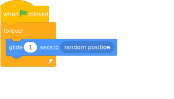
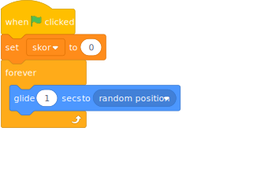
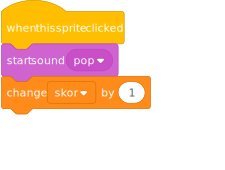
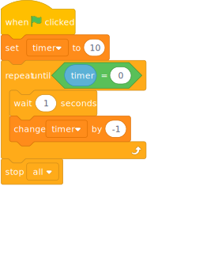
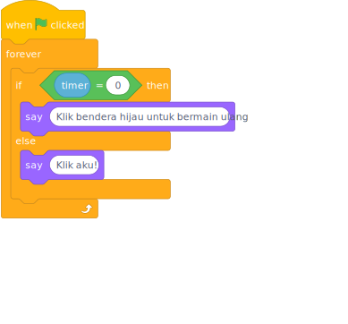

Kita akan membuat game "Tangkap Aku!". Pada game ini akan ada kupu-kupu yang terbang secara acak, jika kita klik kupu-kupu tersebut kama skor bertambah satu. Waktu game ini yaitu 10 detik.

<iframe class="responsive-iframe" src="https://scratch.mit.edu/projects/542176382/embed" allowtransparency="true" width="485" height="402" frameborder="0" scrolling="no" allowfullscreen></iframe>

## Apa yang akan kamu pelajari?

- Penggunaan variabel untuk membuat skor dan timer
- Penggunaan konsep loop dan random untuk membuat kupu-kupu terbang secara acak

## Menyiapkan Sprite dan background

Kita akan menggunakan sprite kupu-kupu (keyword: butterfly) namun kamu dapat memilih sendiri sprite dan background yang kamu sukai.

Membuat kupu-kupu terbang secara acak

Kita ingin selama game dimulai, kupu-kupu berterbangan secara acak.

<iframe class="responsive-iframe" src="https://scratch.mit.edu/projects/542766769/embed" allowtransparency="true" width="485" height="402" frameborder="0" scrolling="no" allowfullscreen></iframe>

*tekan bendera hijau untuk melihat kupu-kupu terbang.*

Karena kita harus menginstruksikan Scratch dengan jelas, maka instruksi yang dapat diberikan ialah

"Selama game berlangsung, tiap satu detik, kupu-kupu menuju ke titik koordinat acak"

Kita akan ubah instuksi di atas ke dalam susunan block

## menambahkan skor

Kita ingin supaya saat kita menekan kupu-kupu, skor bertambah satu dan suara "pop" berbunyi, kita juga ingin saat game dimulai ulang, skor diubah menjadi nol.

Sebelum menyusun instruksi, terlebih dahulu kita membuat variabel skor.

Susunan instruksinya ialah sebagai berikut

1. Ketika kupu-kupu diklik
2. Bunyikan suara "pop"
3. Variabel skor bertambah satu

Untuk dapat mengubah variabel skor menjadi nol setiap game dimulai ulang, kita dapat menambahkan block  ke susunan block sebelumnya.

Kita akan ubah instruksi di atas ke dalam susunan block

## Menambahkan timer

Tantangan dalam game ini yaitu adanya timer sepuluh detik. Terlebih dahulu kita membuat variabel timer. Instruksi untuk membuat timer pada Scratch adalah sebagai berikut.

1. Ketika bendera hijau diklik
2. Atur variabel timer menjadi sepuluh
3. tunggu satu detik, setelah itu variabel timer berkurang satu, ulangi instruksi ini sampai variabel timer sama dengan nol
4. stop semuanya

Susunan block-nya sebagai berikut.

## Menambahkan conditional

Kita akan membuat kupu-kupu berkata "Klik aku!" saat timer belum nol, jika timer sudah nol maka kupu-kupu berkata "Klik bendera hijau untuk bermain ulang". Susunan instruksi ini menggunakan konsep conditional. Susunan block-nya sebagai berikut.

