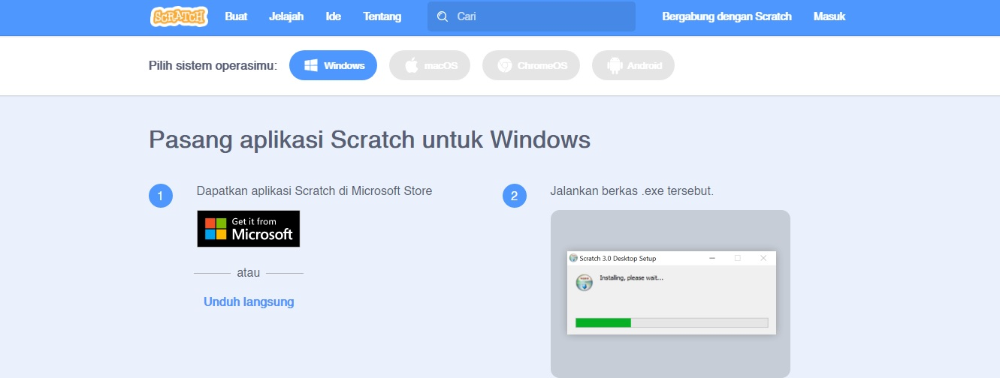

## Aplikasi Scratch

Scratch adalah aplikasi untuk membuat aplikasi. Scratch merupakan aplikasi yang mudah dipelajari karena block-based.

Di Scratch kita dapat membuat cerita animasi, game, simulasi dan lain-lain.
Scratch dirancang oleh Universitas MIT untuk memperkenalkan coding ke anak-anak.

## Mengunduh dan Memasang Scratch

Kalian dapat mengunduh Scratch di situs https://scratch.mit.edu/download.

Terdapat dua opsi pengunduhan, pertama langsung mengunduh di Windows Store (untuk pengguna Windows) atau mengunduh berkas .exe terlebih dahulu. Jika kalian memilih untuk mengunduh berkas .exe setelah terunduh kalian dapat langsung menjalankan berkas .exe.

**Selanjutnya:**
<a href="../2-lingkungan-kerja">Lingkungan Kerja</a>
