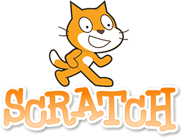

Scratch adalah aplikasi untuk membuat aplikasi. Scratch merupakan aplikasi yang mudah dipelajari karena block-based.

Di Scratch kita dapat membuat cerita animasi, game, simulasi dan lain-lain.
Scratch dirancang oleh Universitas MIT untuk memperkenalkan coding ke anak-anak.

**Selanjutnya:**
<a href="../2-lingkungan-kerja">Lingkungan Kerja</a>
