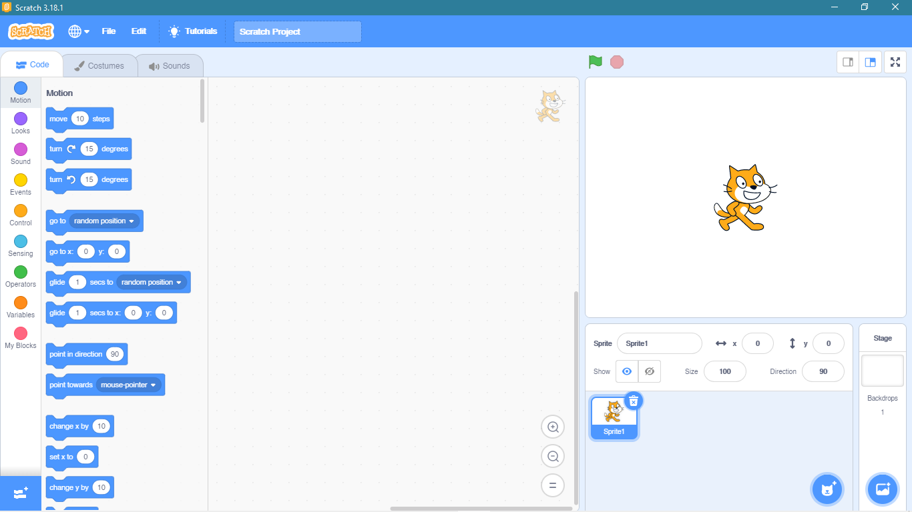
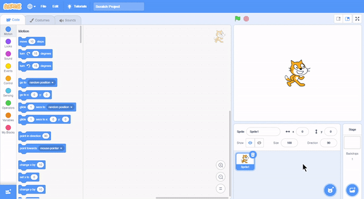
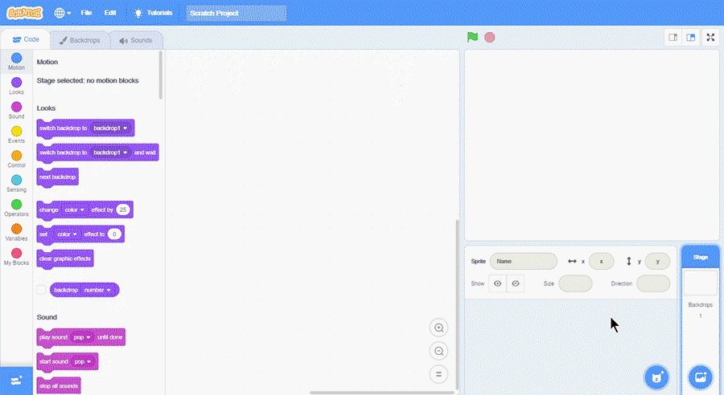
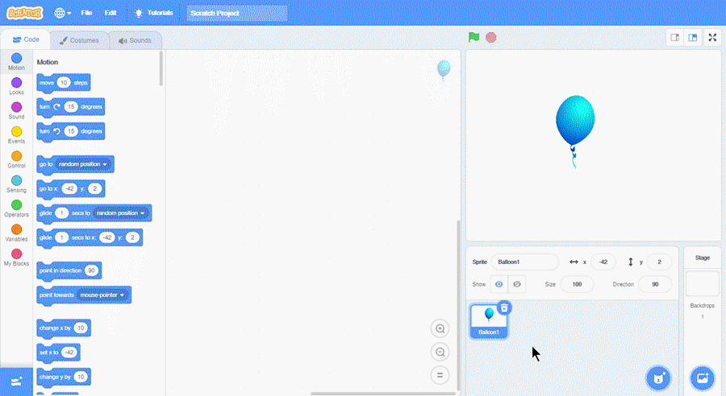

## Apa itu Sprite?
Sprite adalah suatu objek (gambar atau kumpulan gambar) yang tertampil di stage untuk melakukan hal-hal yang sesuai dengan kehendak kita di dalam suatu program. Sprite dapat dibuat sendiri atau dipilih  di library sprite. Sprite dapat dihapus, digandakan, diunduh, dan dimunculkan/disembunyikan.

## Sprite Awal
Sprite awal saat Scratch pertama kali dibuka adalah karakter kucing.

Sprite awal tersebut merupakan maskot dari aplikasi Scratch.

## Menghapus Sprite
Pada Sprite Pane, terdapat ikon tong sampah untuk menghapus sprite.

## Menambahkan Sprite
Jika kita ingin menambahkan sprite baru, klik ikon kucing pada Sprite Pane.

## Menambahkan Background
Selain menambahkan sprite, kita juga dapat menambahkan background. Background dapat ditambahkan pada sprite pane sesuai.

**Sebelumnya:**
<a href="../2-lingkungan-kerja">Lingkungan Kerja</a>

**Selanjutnya:**
<a href="../4-first-block">Menyusun Block Pertamamu!</a>
