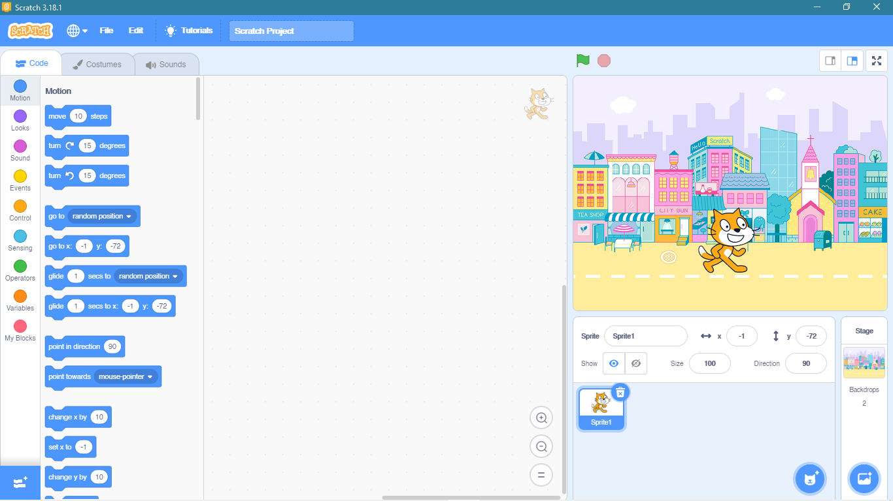
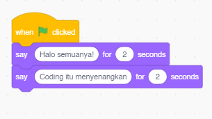
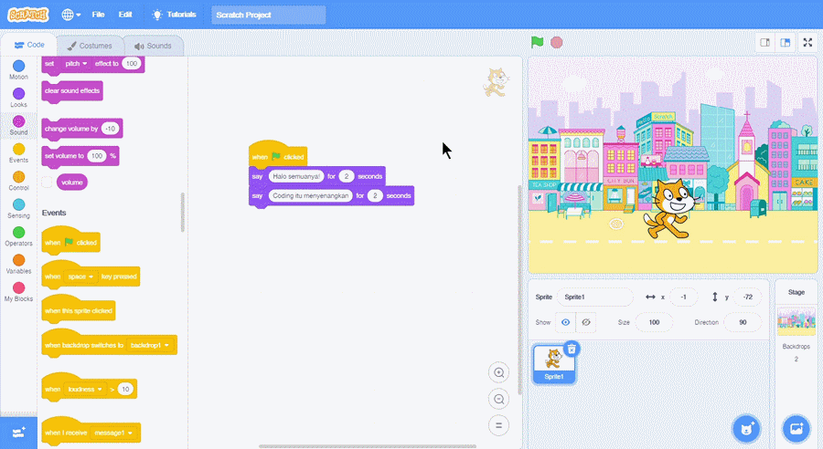

## Menambahkan Sprite dan background

Pertama-tama, kita akan menambahkan background dan sprite. Misalnya kita memilih background dan sprite sebagai berikut.

## Menyusun blocks
Selanjutnya kita akan menyusun langkah-langkah program. Pada contoh ini, kita ingin supaya sprite menyapa kita dengan sapaan "Halo semuanya!" dan dilanjutkan dengan "Coding itu menyenangkan"
Contoh susunan block-nya adalah sebagai berikut.

## Hasil
Jalankan programnya dengan menekan tombol "bendera hijau"

Kalian dapat bereksplorasi secara mandiri dalam menyusun code pada scratch. Selamat mencoba!

**Sebelumnya:**
<a href="../3-background-sprite">Background dan Sprite</a>
