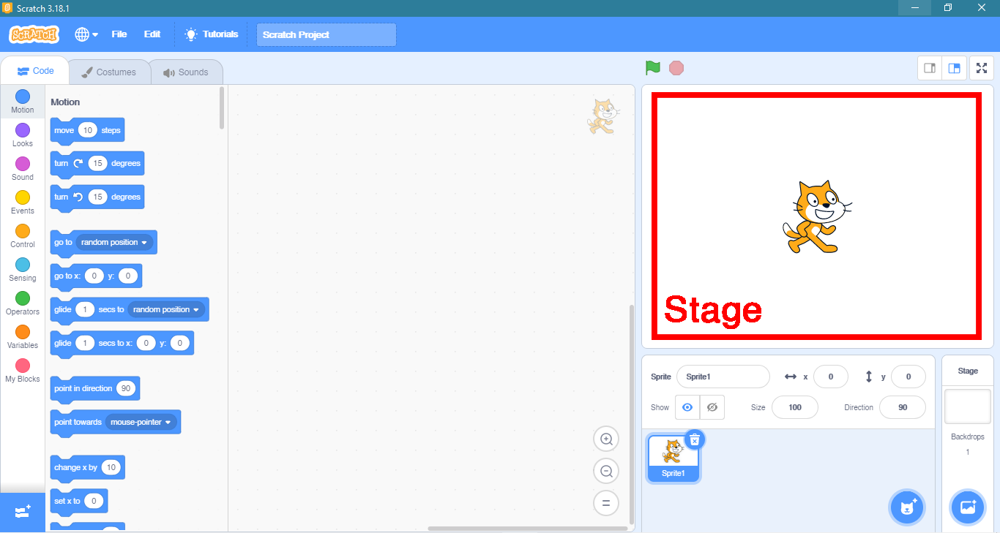
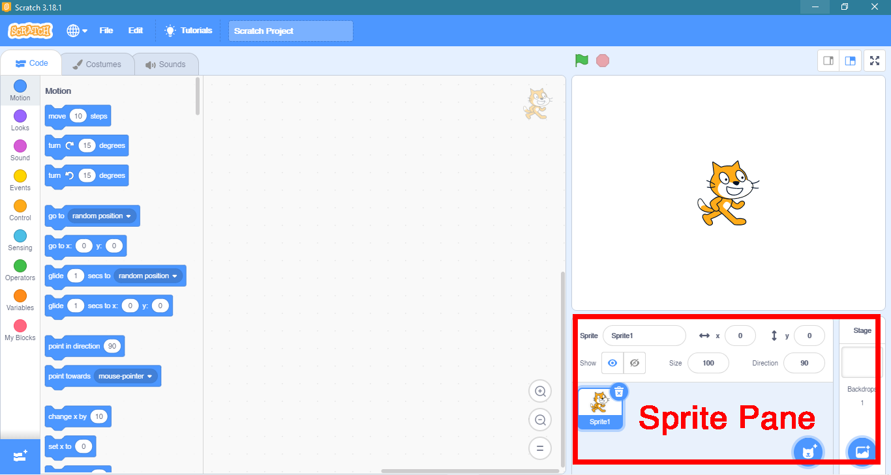
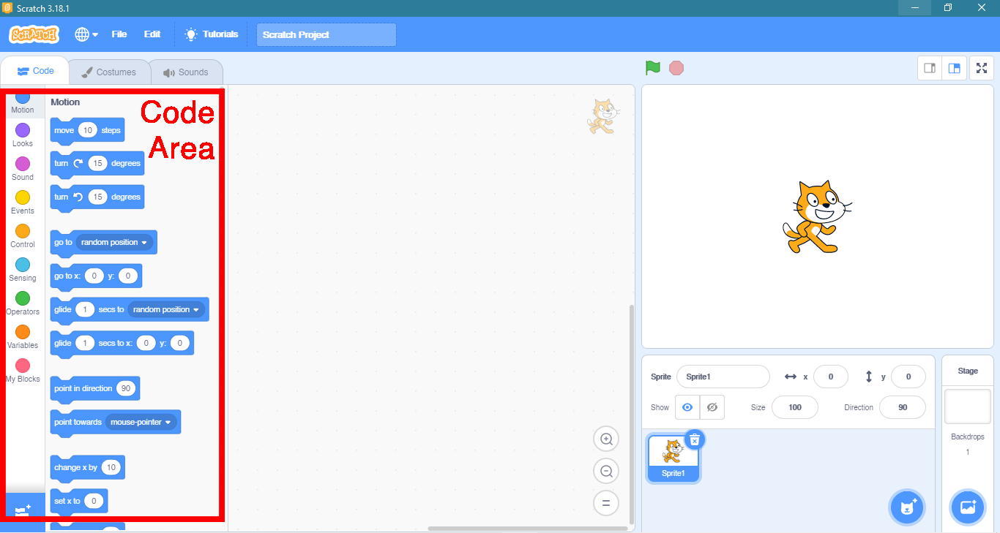
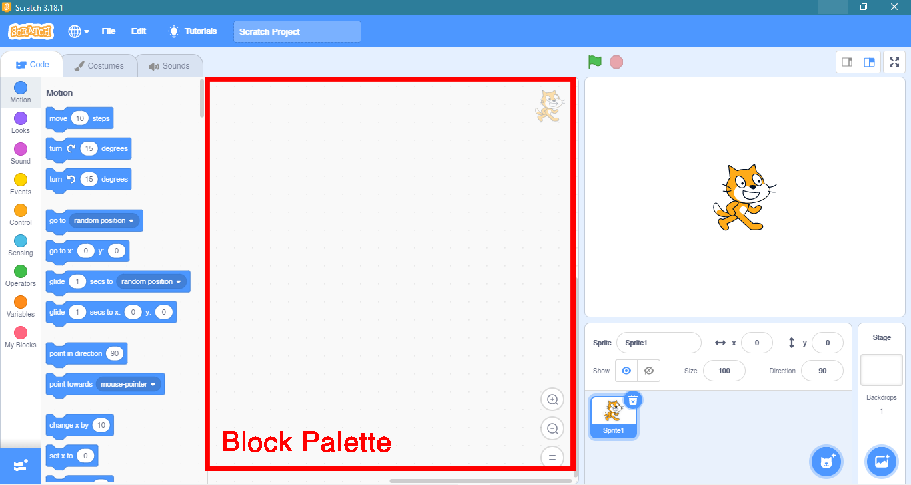

Pada aplikasi Scratch, lingkungan kerjanya dibagi menjadi empat bagian, antara lain:

## Stage

Stage adalah tempat sprite. Sprite akan melaksanakan perintah sesuai block pada stage.

## Sprite Pane

Sprite Pane merupakan tempat untuk mengubah, menambahkan maupun menghapus sprite.

## Code Area

Code area adalah tempat kosong yang siap untuk diisi susunan block. Block dapat langsung digeser dari block palette.

## Block Palette

Block Palette berisi berbagai block yang sudah dikelompokkan sesuai fungsinya. Kelompok-kelompok block pada Scratch antara lain: Motion, Looks, Sound, Events, Controls, Sensing, Operators, Variables, My Blocks.
