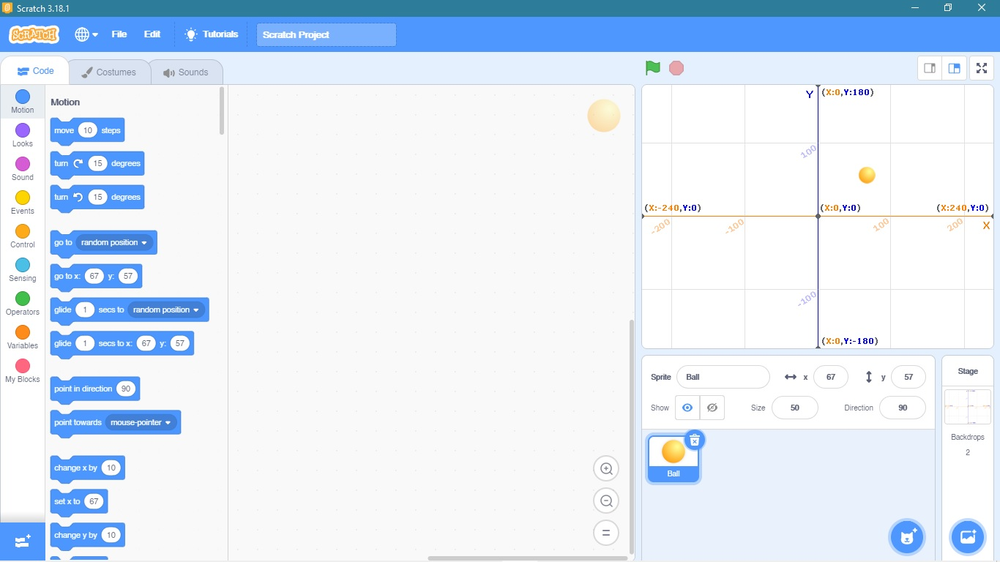



Selamat, kamu sudah berkenalan dengan dunia coding dan belajar Scratch. Sekarang saatnya kamu membuat program di Scratch. Di laman ini, kamu akan ditantang untuk membuat program yang berkaitan dengan transformasi geometri di Scratch.

## Persiapan

Sebelum membuat program, kita akan menyiapkan background dan sprite yang sesuai dengan transformasi geometri. Untuk background, kita menggunakan background yang merepresentasikan bidang kartesius (keyword: grid). Untuk sprite, kita menggunakan bola yang merepresentasikan titik (keyword: ball).

## Kegiatan 1: Membuat Program refleksi

Pada kegiatan 1 kalian akan mencoba membuat program yang dapat merefleksikan bola (kalian boleh memilih salah satu sumbu refleksi yang akan digunakan).

Misalkan pengguna ingin meletakkan bola di titik (0, 1) dan sumbu refleksi yang digunakan adalah sumbu x,  maka program haruslah dapat merleksikan bola sampai ke titik (0, -1).

## Kegiatan 2: Membuat Program Translasi

Pada kegiatan 2 kalian akan mencoba untuk membuat program yang dapat mentranslasikan bola sesuai dengan masukan vektor pengguna.

Misalkan pengguna ingin meletakkan bola di titik (0, 1) dan mentranslasikan bola dengan arah vektor (1, 1) maka bola haruslah bergeser ke arah (1, 2).


Kalian memerlukan block yang dapat menggerakan bola, selain itu kamu juga memerlukan block yang dapat menyimpan variabel untuk menyimpan arah vektor.


## Kegiatan 3: Membuat Program Rotasi

Pada kegiatan 3 kalian akan mencoba untuk membuat program yang dapat merotasikan bola sesuai dengan masukkan besar sudut rotasi dengan pusat (0, 0).

Misalkan pengguna ingin meletakkan bola di titik (0, 1) dan merotasikan bola dengan besar sudut 90 derajat dan berpusat di (0, 0) maka program haruslah dapat merotasikan bola sampai ke titik (1, 0).


Kalian memerlukan block yang dapat menggerakan bola, selain itu kamu juga memerlukan block yang dapat menyimpan variabel untuk menyimpan besar sudut.


## Kegiatan 4: Membuat Program Dilatasi

Pada kegiatan 4 kalian akan mencoba membuat program yang dapat mendilatasikan bola sesuai dengan masukkan faktor skala penggguna.

Misalkan pengguna ingin meletakkan bola di titik (0, 1) dan memilih faktor skala 2 maka program haruslah dapat mendilatasikan bola sampai ke titik (0, 2).
